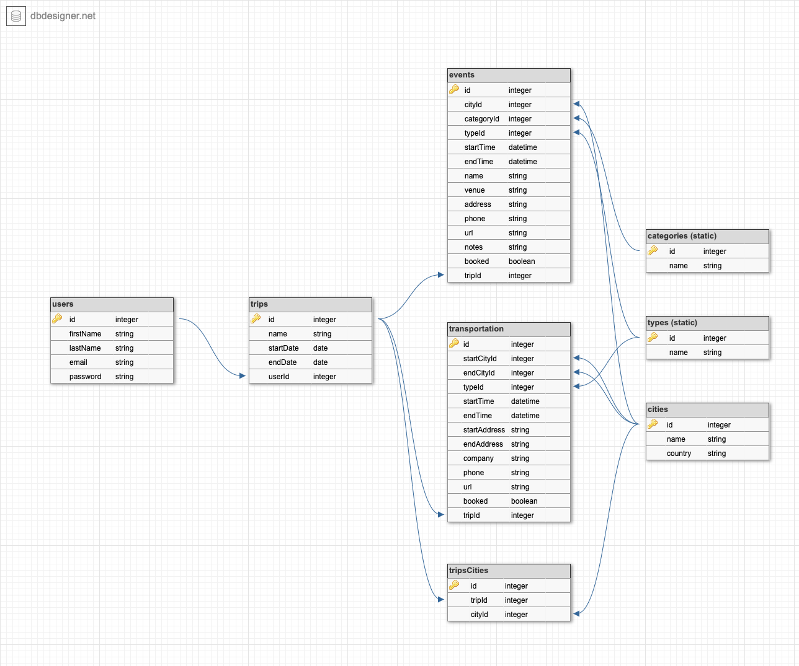
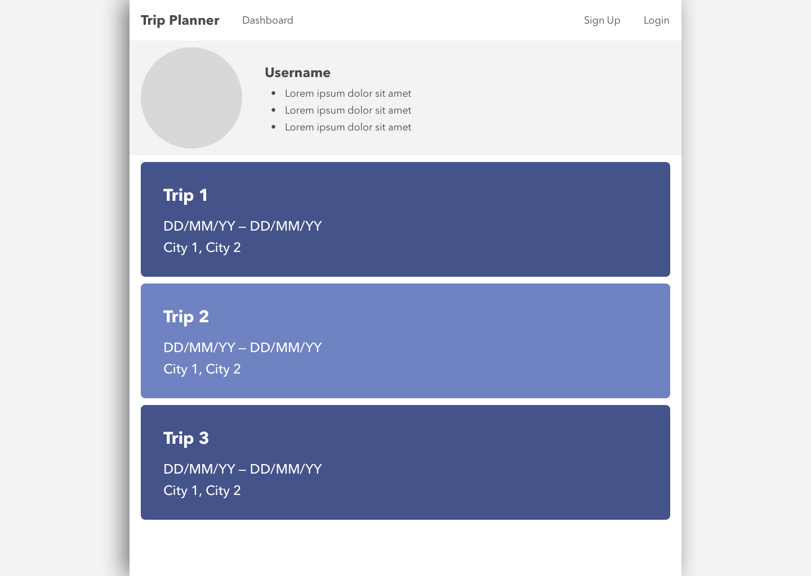
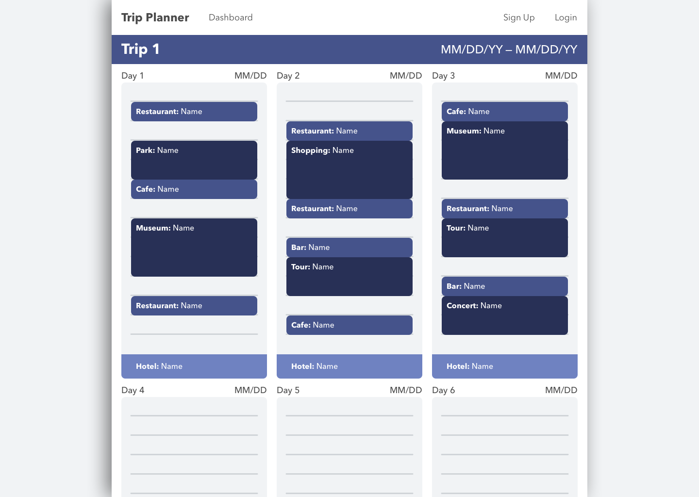

# Project 2 Planning

Fork & Clone this repo.

## Part 1

Review the [Project 2 requirements](https://romebell.gitbook.io/sei-1019/projects/project-2) and check out some [examples](https://tmdarneille.gitbook.io/seirfx/11-projects/past-projects/project2).

In this space below, list **THREE** ideas for your Project 2. For each idea, include [user stories](https://revelry.co/user-stories-that-dont-suck/) for each idea and a link to the API(s) you want to use for it.

---

1. Trip/vacation planning app
- Who: travelers who like to plan their trips in advance; organized and disorganized travelers alike
- What: an easy way to record potential trip plans—dinner at a restaurant, for example—and see if and how they fit into your schedule
- Why: trip planning can be overwhelming, because you need to keep track of a lot of details while remaining flexible. Many modern travelers would benefit from a way to jot down each and every idea they get, while also being able to shift those ideas around until a feasible schedule has been created. Ultimately, these travelers just want to get the most out of their trips.

2. Checkbook balancing/transaction tracking app
- Who: individuals who prefer or need to take a more hands-on approach when it comes to tracking their spending
- What: a fast, straight-forward way to record financial transactions, without too many bells and whistles
- Why: there are a plethora of apps that connect to one's financial accounts and provide their details and balances, but this info isn't always up-to-date. For many, the ability to see how much money is available at any given second is important, and to achieve that, they need to keep track of their own transactions. In addition, there are those that prefer to track their own spending, and find that it helps them budget and stay educated. All of these people would benefit from an easy way to do that.

3. "See It or Seen It" movie tracking app
- Who: movie-lovers of varying degrees
- What: a way to keep track of the movies you've seen and want to see
- Why: with the number of available movies constantly growing, particularly with the expansion of streaming movies, it can be difficult to remember what you've seen, what you liked, what you disliked and what you've been wanting to see. Not too long ago, building a library of tapes and DVD's was sort of a way to do this, but that's gone by the wayside. Even though it's easier to access movies than ever before, there's still a desire to "collect" what you've seen, and share that collection—and your impecable taste in movies—with others.

---

Make a PR when you're done!

---

## Part 2

In the space below:
* either embed or link a completed ERD for your approved P2 idea
* if there are any changes/additions to your user stories, place your full set of revised user stories here
* either embed or link wireframes for every page of your app

----------------------------------------------------------
### ERD

----------------------------------------------------------
### User Stories
- Who: travelers who like to plan their trips in advance; organized and disorganized travelers alike
- What: an easy way to record potential trip plans—dinner at a restaurant, for example—and see if and how they fit into your schedule
- Why: trip planning can be overwhelming, because you need to keep track of a lot of details while remaining flexible. Many modern travelers would benefit from a way to jot down each and every idea they get, while also being able to shift those ideas around until a feasible schedule has been created. Ultimately, these travelers just want to get the most out of their trips.

----------------------------------------------------------
### Wireframes

----------------------------------------------------------

Make a PR when you're done!
